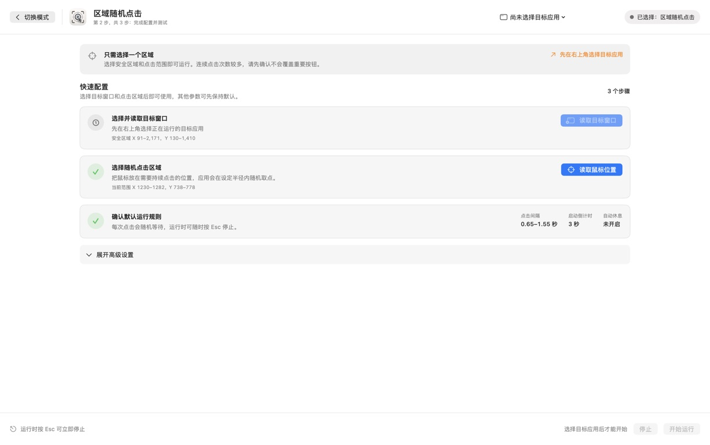
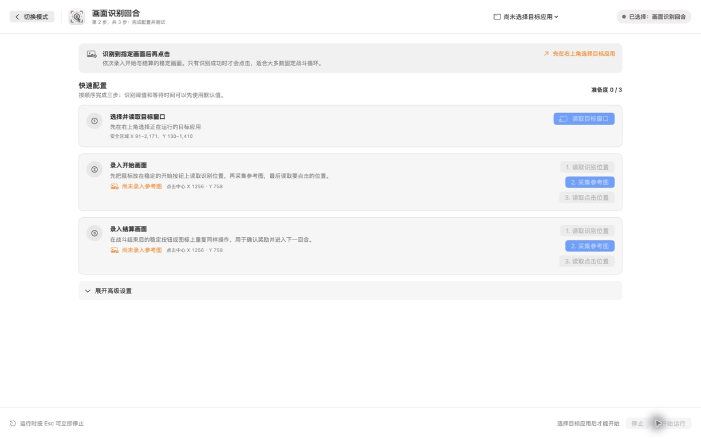
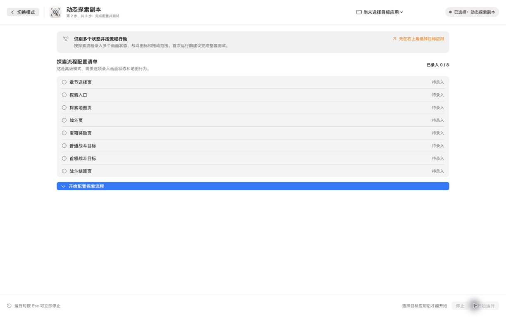

# 游戏点击助手 3.0

一个面向 macOS 的本地图像识别与点击自动化工具，可用于《阴阳师》的固定点击、固定回合和探索副本流程。

> [!CAUTION]
> 本项目不是网易或《阴阳师》的官方工具，与网易及游戏运营方没有隶属、合作或授权关系。自动化操作可能违反游戏用户协议或运营规则，并可能造成误点击、资源损失、账号限制或封禁。使用者必须自行确认规则、测试配置并承担全部风险。请勿在无人看管、重要账号或无法承受损失的环境中运行。


## 3.0 有什么变化

- 将功能整理为三种用途清晰的模式，并提供统一的三步配置流程。
- 方案、图像、坐标、运行时长和等待节奏都能在开始前核对。
- 所有模式均支持 `Esc` 紧急停止。
- 动态探索使用多状态识别、圆形战斗目标定位和地图拖动。
- 提供脱敏后的《阴阳师》示例参数；不会附带个人模板、日志或本机窗口状态。
- 诊断日志只保存在用户本机，不自动上传。

## 三种模式怎么选

| 模式 | 用途 | 行为 | 必须配置 | 主要差异 |
|---|---|---|---|---|
| 区域随机点击 | 固定界面、重复点击、需要持续点按的位置 | 在指定椭圆区域内按随机间隔连续点击 | 目标应用、游戏安全区域、点击中心和半径 | 配置最少，但连续误点风险最高；不读取画面状态 |
| 画面识别回合 | 御魂、爬塔等“开始 → 战斗 → 结算”的固定循环 | 只在开始图或结算图达到阈值时点击 | 一套玩法方案、开始/结算参考图、检测区域、点击区域、回合时间 | 点击次数较少，依赖窗口画面稳定；适合大多数固定战斗循环 |
| 动态探索副本 | 探索地图、普通战斗、首领战斗、宝箱和结算切换 | 识别多个页面状态，寻找圆形目标，必要时拖动地图 | 八项探索配置、地图搜索范围、战斗目标尺寸、拖动范围、流程时间 | 配置最多；能处理状态切换，但首次使用必须完整测试 |

### 1. 区域随机点击



适合游戏画面固定、目标按钮不会移动的场景。程序不会判断当前页面是什么，只会在安全边界内随机取点。

开始前必须核对：

1. 右上角目标应用已选择“阴阳师”。
2. 安全区域只覆盖游戏内容，不包含标题栏、Dock 或其他应用。
3. 点击区域不会覆盖购买、删除、确认消耗等危险按钮。
4. 点击间隔、运行时长/次数和自动休息符合你的计划。

### 2. 画面识别回合



适合御魂、爬塔等固定循环。每套方案独立保存开始图、结算图、坐标与时间：

1. 选择或新建方案，例如“御魂”。
2. 为开始与结算分别读取检测区域、采集参考图，再读取点击位置。
3. 设置最早开始检测结算、最长等待、结算后间隔和停止条件。
4. 手动测试两类画面，确认识别分数稳定高于阈值后再运行。

识别区域用于“看”，点击区域用于“点”，两者不要混为一处。参考图应来自同一窗口尺寸、缩放、画质和界面状态。

### 3. 动态探索副本



动态探索会按流程处理以下八项：章节选择页、探索入口、探索地图页、战斗页、宝箱奖励页、普通战斗目标、首领战斗目标、战斗结算页。

开始前必须：

1. 逐项录入稳定参考图和对应区域，不能只复制坐标。
2. 让地图搜索区域覆盖可能出现战斗目标的位置，但避开固定装饰圆形。
3. 按实际 UI 尺寸校准战斗图标直径；示例值 `147` 仅供参考。
4. 核对普通/首领战斗等待、地图无目标后拖动时间、拖动距离与稳定等待。
5. 在可控场景跑完“进图 → 普通战斗 → 结算 → 宝箱/首领 → 返回”的完整测试。

程序对普通战斗圆形目标使用不低于 `0.85` 的置信度安全门槛，但任何阈值都不能保证在所有分辨率、皮肤、活动界面和动画帧中正确。

## 系统与权限要求

- macOS 15.2 或更高版本。
- 当前发布候选在 Apple Silicon Mac 上构建和验证；Intel 源码构建路径已保留，但尚未实机验证。
- 辅助功能权限：用于发送鼠标点击、拖动和监听全局 `Esc`。
- 屏幕录制权限：用于读取目标窗口和进行图像识别。
- 《阴阳师》macOS 客户端正在运行，默认识别信息为：
  - 应用名：`阴阳师`
  - Bundle ID：`com.netease.onmyoji`

首次授权后，通常需要完全退出并重新打开应用。窗口位置、系统缩放、游戏分辨率或画质变化后，应重新读取区域并采集参考图。

## 安装与首次使用

1. 从 Release 下载 `OnmyojiClicker-3.0-macOS.zip` 并解压。
2. 将 `GameClickAssistant.app` 移到“应用程序”文件夹。
3. 首次打开时，在“系统设置 → 隐私与安全性”中检查应用来源并明确允许打开。
4. 按提示授予辅助功能和屏幕录制权限，然后重启应用。
5. 选择模式，在右上角选择“阴阳师”，按页面步骤完成配置。
6. 先使用手动测试或短时运行；确认无误后再增加时长。

当前候选包采用临时签名，未使用 Apple Developer ID 公证。Gatekeeper 提示属于分发信任状态，不代表应用已经经过 Apple 审核。若不愿允许运行未公证应用，请不要运行当前候选包。

## 示例配置

[examples/onmyoji-reference.json](examples/onmyoji-reference.json) 保留了 3.0 验证环境中的坐标、阈值与时间参数，同时移除了模板文件名、配置 UUID、日志和窗口历史。

该文件是“配置参考”，不是一键导入文件。原因是参考图必须由每台设备在自己的窗口中采集；即使 Mac 型号相同，显示缩放、窗口位置和游戏设置也可能不同。运行逻辑、必做配置与逐模式验收方法见 [配置手册](docs/CONFIGURATION.md)。

## 本地数据与隐私

运行时数据位于：

```text
~/Library/Application Support/GameClickAssistant/
├── Templates/                 # 用户自己采集的参考图
├── diagnostic.log            # 当前诊断日志，最大约 2 MB
├── diagnostic.previous.log   # 轮换后的上一份日志
├── status.log                # 当前状态
└── stop                      # 停止标记
```

应用不会主动联网或上传这些文件。公开仓库和 3.0 应用包不包含上述目录、个人参考图、历史日志、旧压缩包或开发缓存。提交问题前请自行检查日志中是否包含应用名、配置名、坐标等不希望公开的信息。

## 公开发布内容

3.0 默认采用二进制公开方式，GitHub 仓库与 Release 仅包含：

- `README.md`、三模式说明、配置手册和界面截图；
- 脱敏后的参数参考文件；
- `CHANGELOG.md`；
- `OnmyojiClicker-3.0-macOS.zip` 应用包及 SHA-256 校验值。

源代码、构建脚本、测试代码、个人参考图和本机日志不在公开清单内。二进制仍可能被逆向分析，因此“不公开源码”不等于技术上不可分析。

## 已知限制

- 图像识别会受到分辨率、窗口缩放、动画、遮挡、主题和活动 UI 变化影响。
- 当前不提供云同步、自动下载模板或远程控制。
- 未完成 Developer ID 签名与 Apple 公证，不适合无提示的大规模分发。
- 自动化行为是否符合游戏规则由使用者自行确认；项目不承诺账号安全或持续可用。

## 使用与再分发

当前公开版本只授权用户自行下载并承担风险地使用二进制，不随包提供源代码授权。未经作者另行许可，不得以官方版本名义修改、重新打包或收费分发。游戏名称与相关商标归其权利人所有。
