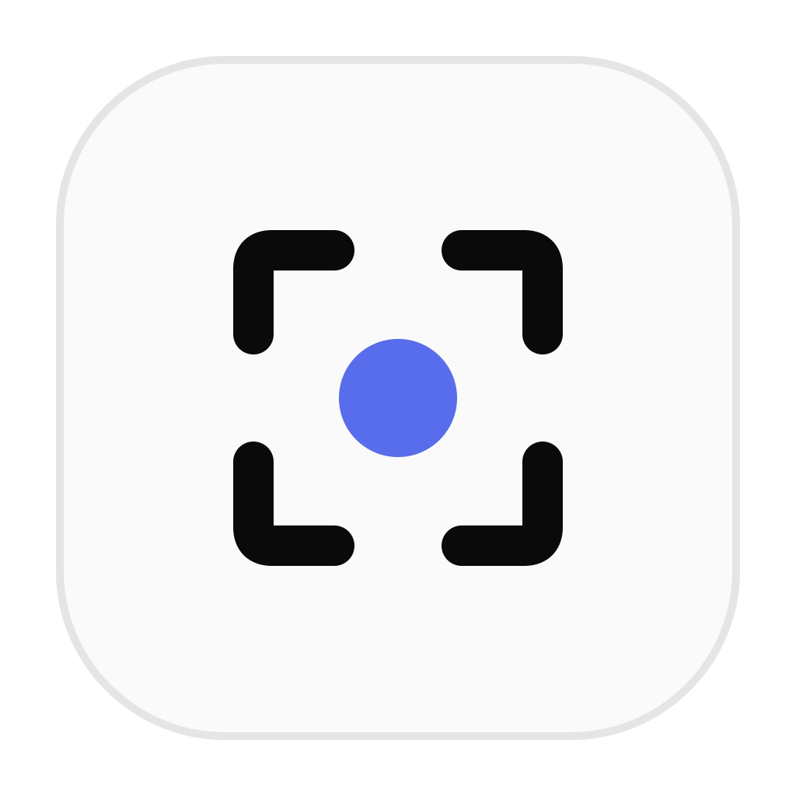
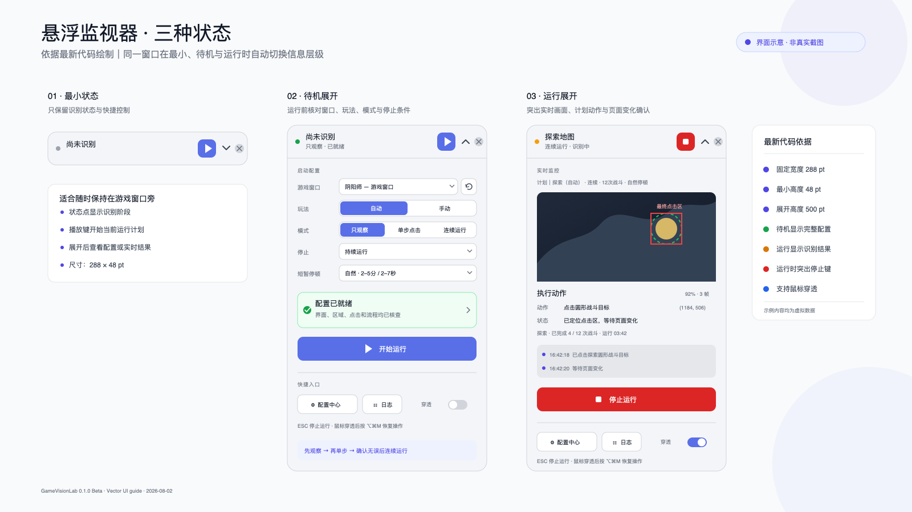
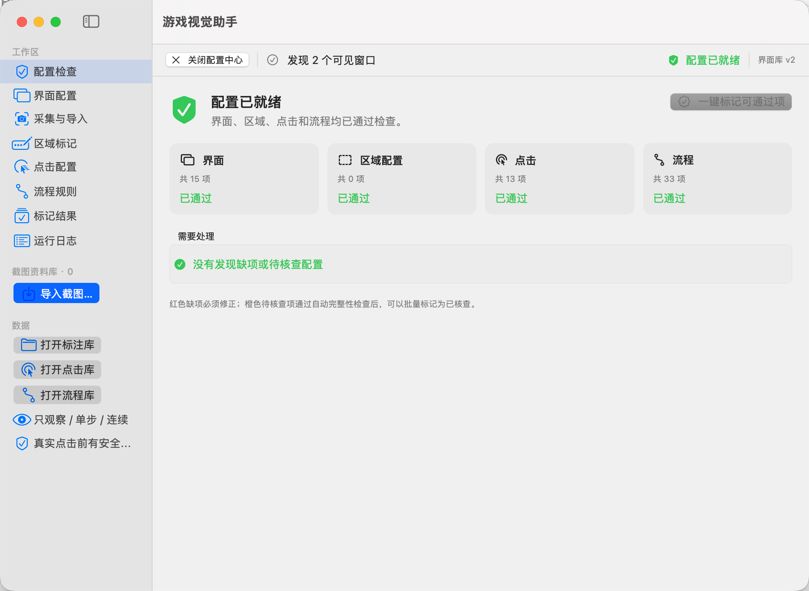
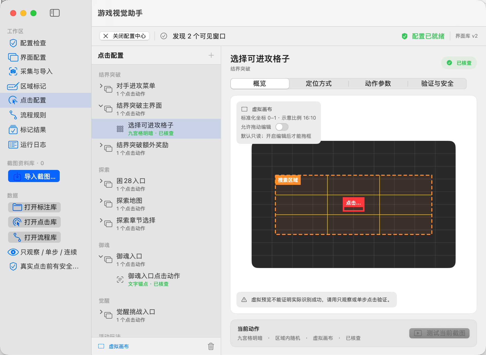

# 游戏视觉助手 1.0.1

这是原“游戏点击助手”的新一代 `GameVisionLab` 内核：在原有点击流程基础上加入窗口级截图、OCR 文字识别、相对区域定位、界面状态确认和更严格的点击安全检查。

> [!CAUTION]
> 本项目不是网易或《阴阳师》的官方工具，与网易及游戏运营方没有隶属、合作或授权关系。自动化操作可能违反游戏用户协议或运营规则，并可能造成误点击、资源损失、账号限制或封禁。使用者必须自行确认规则、测试配置并承担全部风险。

## 下载

从 [GameVisionLab 0.1.1 Beta Release](https://github.com/RoyJHQin/OnmyojiClicker-Releases/releases/tag/gamevisionlab-v0.1.1-beta) 下载：

- `GameVisionLab-1.0.1-macOS-arm64.zip`
- `GameVisionLab-1.0.1-macOS-arm64.zip.sha256`

当前测试包支持 Apple Silicon Mac，要求 macOS 14.0 或更高版本。

## 这次升级了什么

- 使用 Apple Vision OCR 识别简体中文、繁体中文和英文。
- 先确认当前界面，再决定等待、点击、拖动或停止。
- 搜索区域和点击区域均使用游戏窗口相对比例，不依赖固定屏幕坐标。
- OCR 按钮会跟随文字位置动态锁定；例如结界突破的“进攻”按钮不是固定坐标。
- 点击后必须确认界面或画面发生变化，否则只进行有限次数重试。
- 支持观察、单步和连续运行。
- 支持 `Esc` 紧急停止和游戏窗口安全区域约束。
- 内置脱敏后的默认配置，不需要附带开发者的原始截图。

## 界面示意

### 悬浮监视器

悬浮窗会根据状态调整信息层级：最小状态保留快捷控制；待机展开用于核对窗口、玩法和运行条件；运行展开显示实时识别、预计动作、页面变化和停止入口。

### 配置中心

#### 配置检查

#### 点击配置

配置中心用于检查和修改界面文字、相对区域、点击动作及流程规则。以上为当前版本真实界面截图，仅展示脱敏默认配置，不包含玩家截图、账号信息或本机路径。

## 内置默认配置

首次安装时，App 已经带有一套由开发者根据自己实际采集的游戏画面整理、标注和核查过的默认配置。原始采集截图已经移除，公开包只保留运行需要的界面特征、OCR 文字、相对区域、动作和流程规则。

当前默认流程包括：

- 探索：章节选择、困 28 入口、探索地图圆形目标、战斗状态和结算；
- 结界突破：九宫格目标、对手进攻菜单、战斗状态、结算和额外奖励；
- 御魂：御魂入口、战斗状态和结算；
- 觉醒：觉醒挑战入口、战斗状态和结算；
- 秘闻 / 爬塔：战斗状态和结算（当前默认流程不包含入口点击）；
- 鬼兵演武：活动战斗入口、战斗状态和结算。

合计内置：

- 16 个界面定义；
- 13 个已核查点击动作；
- 6 套流程、33 个已核查节点；
- 探索、结界突破、御魂、觉醒、爬塔和鬼兵演武流程。

配置包括 OCR 必须/可选/排除文字、标准化搜索区域、标准化点击区域、识别阈值、页面跳转关系、等待和重试规则。

这些是可以修改的起始配置，不是不可更改的固定程序。用户可以在“配置中心”调整界面文字、搜索区域、点击区域、识别阈值、动作以及下一界面关系；自定义结果保存在本机。

原始截图只用于开发期标注和验证，不是默认运行配置的必需文件。公开包不包含玩家截图、聊天内容、账号信息、窗口历史、日志、本机路径或屏幕绝对坐标。

## 第一次使用建议

1. 先选择正确的游戏窗口，并使用“只观察”模式，不发送任何点击。
2. 检查监视窗口中锁定的游戏窗口、识别出的当前界面、OCR 文字和目标区域是否正确，同时核对它显示的预计下一步行为是否符合当前画面。
3. 观察结果正确后，再使用“单步点击”，一次只执行一个动作，并确认点击位置及页面变化符合预期。
4. 观察和单步都正确后，才开始连续运行。
5. 如果出现界面识别错误、点击区域偏移或下一步判断异常，请先停止运行，再到“配置中心”手动更新相应的文字、区域、动作或流程配置，核查正确后再继续。

不同分辨率、游戏语言、UI 版本和画质可能带来差异，因此建议每位新用户都完成一次上述核查。

## 安装

1. 解压 ZIP，将 `GameVisionLab.app` 拖入“应用程序”。
2. 第一次尝试打开后，如果 macOS 阻止启动，进入“系统设置 → 隐私与安全性”，点击“仍要打开”。
3. 授予屏幕录制和辅助功能权限，然后完全退出并重新打开 App。
4. 选择《阴阳师》窗口，先用观察或单步模式核查，再开始连续运行。

当前包使用临时签名，尚未使用 Apple Developer ID 公证。详细步骤见 [安装说明](DISTRIBUTION.md)。

## 权限和本地数据

- 屏幕录制：只读取用户明确选择的游戏窗口，用于 OCR 和界面识别。
- 辅助功能：在非观察模式发送点击、拖动并监听紧急停止键。
- 用户自己的截图和配置保存在 `~/Library/Application Support/GameVisionLab/`。
- App 不包含联网、遥测、云同步或自动上传功能。

详细数据边界见 [隐私说明](PRIVACY.md)。

## 使用前必须知道

- 不同游戏语言、UI 版本、分辨率、画质和动画状态仍可能影响识别。
- 相对区域可以适应窗口移动和尺寸变化，但不能保证所有设备百分之百开箱准确。
- 首次使用必须保持观察，并核查识别界面和最终点击区域。
- 不建议在重要账号、无人看管或无法承受损失的环境中连续运行。

## 历史版本

- [游戏点击助手 3.0](https://github.com/RoyJHQin/OnmyojiClicker-Releases/releases/tag/v3.0)
- [配置手册（3.0）](docs/CONFIGURATION.md)

## 使用与再分发

当前仓库以二进制形式提供测试版，不随包提供源代码授权。未经作者另行许可，不得以官方版本名义修改、重新打包或收费分发。游戏名称与相关商标归其权利人所有。
